# Apache Airflow Course

*Based on Apache Airflow 3.x (2026). Structured for complete beginners.*

---

## Table of Contents

| # | Section | Topic |
|---|---------|-------|
| **Part I** | **Foundations** | |
| 1 | [What is Airflow?](#1-what-is-airflow) | Core definition, orchestration concept |
| 2 | [What Airflow is NOT](#2-what-airflow-is-not) | Common misconceptions |
| 3 | [Airflow vs Plain Python](#3-airflow-vs-plain-python) | Why not just a script? |
| 4 | [Core Components](#4-core-components) | The 6 building blocks |
| 5 | [Architecture](#5-architecture) | How components interact (Airflow 3.x) |
| 6 | [DAG, Task, Operator](#6-dag-task-operator) | The three core abstractions |
| **Part II** | **Setup** | |
| 7 | [Installation & Setup](#7-installation--setup) | Docker-based install |
| 8 | [The Airflow UI](#8-the-airflow-ui) | Navigating the web interface |
| **Part III** | **Hands-On Chapters** | |
| Ch 1 | [Linear DAG & Parsing](#ch-1-linear-dag--parsing) | Your first DAG |
| Ch 2 | [DAG Versioning](#ch-2-dag-versioning) | How Airflow tracks changes |
| Ch 3 | [Operators & DAG Syncing](#ch-3-operators--dag-syncing) | BashOperator, syncing |
| Ch 4 | [XCOMs (Automatic)](#ch-4-xcoms-automatic) | Passing data between tasks |
| Ch 5 | [XCOMs (Manual)](#ch-5-xcoms-manual-with-kwargs) | Full control with kwargs |
| Ch 6 | [Parallel Tasks](#ch-6-parallel-tasks) | Fan-out / Fan-in pattern |
| Ch 7 | [Conditional Branches](#ch-7-conditional-branches) | Branching logic |
| Ch 8 | [Scheduling Presets](#ch-8-scheduling-presets) | daily, hourly, weekly, monthly |
| Ch 9 | [Cron Syntax](#ch-9-cron-syntax) | Flexible time-based scheduling |
| Ch 10 | [Delta Trigger](#ch-10-delta-trigger) | Interval-based scheduling |
| Ch 11 | [Incremental Load & Jinja](#ch-11-incremental-load--jinja-templates) | Templating, partial loads |
| Ch 12 | [Special Schedules (Events)](#ch-12-special-schedules-with-events) | Arbitrary date scheduling |
| Ch 13 | [Assets](#ch-13-assets) | Data-aware cross-DAG dependencies |
| Ch 14 | [Inherited DAG Orchestration](#ch-14-inherited-dag-orchestration) | Parent-child DAG patterns |

---

# Part I -- Foundations

---

## 1. What is Airflow?

**Apache Airflow is an open-source framework used as an orchestrator.**

### What does "orchestration" mean?

Think of a **music conductor**: they don't play instruments themselves -- they coordinate *who* plays *when*, in what *order*, and whether some sections play in *parallel*.

Airflow does the same thing for data tasks:

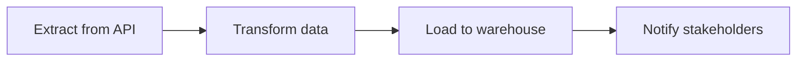

### The Two Problems Airflow Solves

| Problem | Without Airflow | With Airflow |
|---------|----------------|--------------|
| **Task order** | Manual scripting of dependencies | Declared with `>>` operator |
| **Repetition** | Cron jobs + manual monitoring | Built-in scheduling + UI |

### Why Airflow?

1. **Pythonic** -- if you know Python, you can use Airflow (it's a Python SDK)
2. **Web UI** -- monitor, retry, and debug visually
3. **Open source** -- free, massive community, used in production worldwide

---

## 2. What Airflow is NOT

Three critical misconceptions to clear up immediately:

### NOT a Data Processing Framework

Airflow **does not process your data**. It only *tells other systems* to process it.

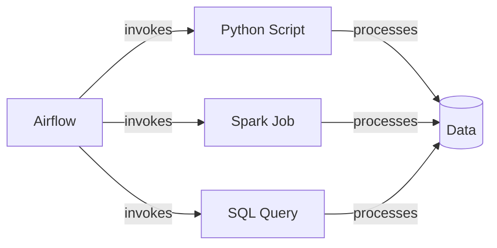

Airflow says *"run this Spark job now"* -- Spark does the actual processing.

### NOT a Real-Time Framework

| Good for | NOT good for |
|----------|-------------|
| Daily runs | Microsecond processing |
| Hourly runs | Continuous streaming |
| Every 15-30 min | IoT sensor ingestion |

For real-time, use Kafka, Flink, or Spark Streaming.

### NOT an ETL Tool

Unlike Azure Data Factory or AWS Glue (which extract, transform, AND load), Airflow only **schedules and orchestrates**. It tells *when* and *what* to run, not *how* to transform.

> **So why use it over ADF/Glue?** Airflow is open-source, handles parallel tasks and scaling better, and avoids vendor lock-in. Even Microsoft Fabric now offers managed Airflow jobs.

---

## 3. Airflow vs Plain Python

A simple linear flow (`Task 1 → Task 2 → Task 3`) can be done with a Python script. So when does Airflow shine?

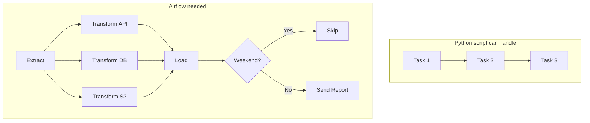

### When Airflow adds value

| Feature | Python Script | Airflow |
|---------|:------------:|:-------:|
| Sequential tasks | Yes | Yes |
| Parallel execution | Manual threading | Built-in |
| Conditional branching | Complex if/else | `@task.branch` |
| Failure handling | try/except chains | Automatic propagation |
| State between tasks | Global variables | XCOMs |
| Scheduling + retries | cron + custom logic | Built-in |
| Visual monitoring | None | Full Web UI |

### Key Terminology

- **Node** = an isolated task in the graph
- **Edge** = a connection (dependency) between nodes
- If a node fails, all downstream nodes are automatically **skipped**

---

## 4. Core Components

Airflow has **7 core components** (+ queues). Understanding them is essential before touching any code.

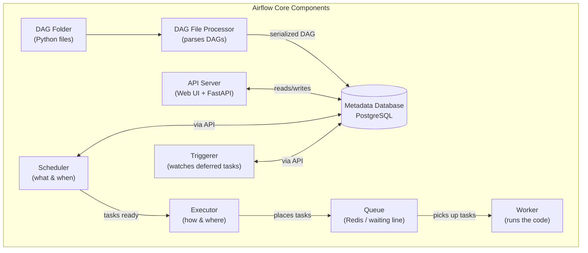

### Component Details

| # | Component | Responsibility | Key Detail |
|---|-----------|---------------|------------|
| 1 | **Metadata Database** | Stores everything: DAG definitions, schedules, task status, XCOMs | Typically PostgreSQL. The backbone of Airflow. |
| 2 | **DAG File Processor** | Continuously scans the `dags/` folder, parses Python files, creates serialized DAGs | Converts your Python code into a JSON-like format stored in the DB |
| 3 | **API Server** | Central hub -- all components communicate through it. Serves the Web UI (React) | Backend is FastAPI. Users only interact with Airflow through this. |
| 4 | **Scheduler** | Decides **what** tasks need to run and **when** | Does NOT execute tasks -- only schedules them |
| 5 | **Executor** | Decides **how** and **where** tasks run (strategy) | Picks a strategy (Local, Celery, Kubernetes) and places tasks into the Queue |
| 6 | **Queue** | A waiting line (typically **Redis**) where tasks sit until a Worker picks them up | Think of it as a ticket counter -- tasks wait in line, workers serve them in order |
| 7 | **Worker** | Actually **runs your code** (Python, Bash, SQL, etc.) | The only component that executes task logic |
| 8 | **Triggerer** | Watches over **deferred** tasks and wakes them up when an external condition is met | See analogy below |

> **Critical distinction**: The **Scheduler** decides *what/when*. The **Executor** decides *how/where*. The **Queue** holds tasks in line. The **Workers** actually *run the code*.

### The Triggerer -- explained with an analogy

The Triggerer is the hardest component to grasp, so here's a concrete example.

**Scenario**: Your DAG has a task that kicks off a Spark job on Databricks. That job takes 45 minutes.

**Without the Triggerer** (bad):
The Worker starts the Spark job, then just **sits there waiting** for 45 minutes doing nothing. That Worker is blocked -- it can't run any other task. If you have 4 Workers, you can block all 4 with long-running waits.

**With the Triggerer** (good):
The Worker starts the Spark job, then says *"I'll defer -- someone else watch this for me"* and **frees itself** to run other tasks. The Triggerer (a lightweight watcher) periodically checks: *"Is the Spark job done yet? No. ... No. ... Yes!"* -- then it updates the database, and the Scheduler sends the task back to a Worker to finish the remaining code.

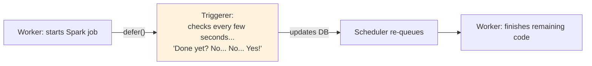

**Think of it like this**: You order food at a restaurant. Instead of standing at the counter staring at the kitchen for 20 minutes (blocking), you sit down (defer) and the waiter (Triggerer) comes to tell you when it's ready. You're free to do other things while waiting.

---

## 5. Architecture

This describes the **Airflow 3.x** architecture. A fundamental change: **no component talks directly to the database** -- all communication flows through the API.

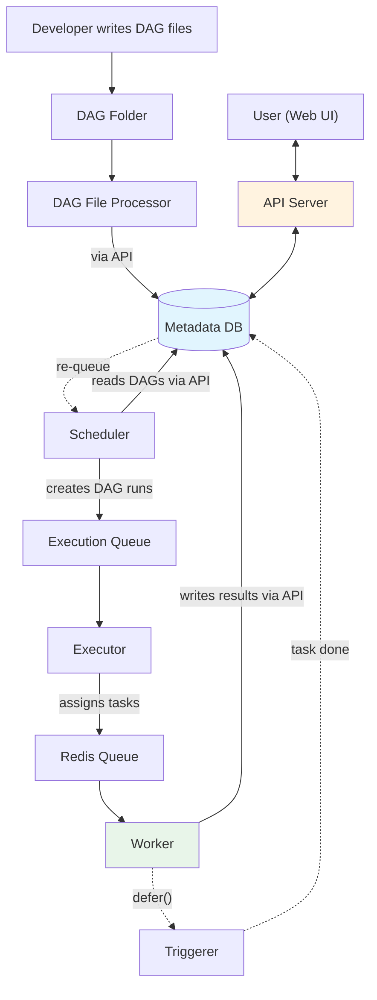

### The Full Task Lifecycle

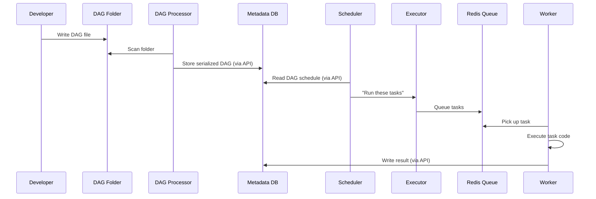

### Deferred Tasks (Triggerer)

For long-running operations (API calls, Spark jobs), a task can **defer** instead of blocking:

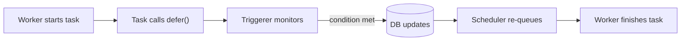

### Two Queue Types

| Queue | Purpose |
|-------|---------|
| **Execution Queue** | Internal to the Executor |
| **Redis Queue** | The actual queue Workers consume from |

### Single-Node vs Production

- **Learning**: Everything runs on one machine (via Docker)
- **Production**: Components on separate machines (API server, DB, workers each on their own node)

---

## 6. DAG, Task, Operator

The three core abstractions you'll use every day.

### DAG (Directed Acyclic Graph)

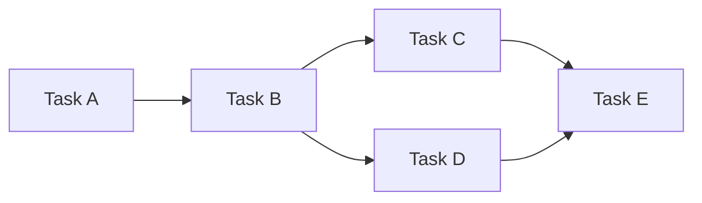

- **Directed**: edges have direction (A → B, not B → A)
- **Acyclic**: no cycles -- a task can NEVER depend on itself (would cause infinite loops)
- **Graph**: nodes (tasks) connected by edges (dependencies)

### Task

A **single unit of work**. One thing you want to do:
- Call an API
- Run a SQL query
- Execute a bash script
- Run a Python function

**Best practice**: Keep tasks **granular**. Small tasks are easier to debug -- you know exactly which step failed.

### Task Instance

A **specific execution** of a task for a given DAG run. One task can produce many task instances over time (one per scheduled run).

### Operator

A **predefined template** that defines the *type* of task.

| Operator | What it does |
|----------|-------------|
| `PythonOperator` / `@task.python` | Runs a Python function |
| `BashOperator` / `@task.bash` | Runs a shell command |
| `SqlOperator` | Runs a SQL query (handles connection boilerplate) |
| `TriggerDagRunOperator` | Triggers another DAG |

**Providers** extend Airflow with hundreds more: AWS, GCP, Azure, Databricks, Snowflake, etc.

### Relationship Diagram

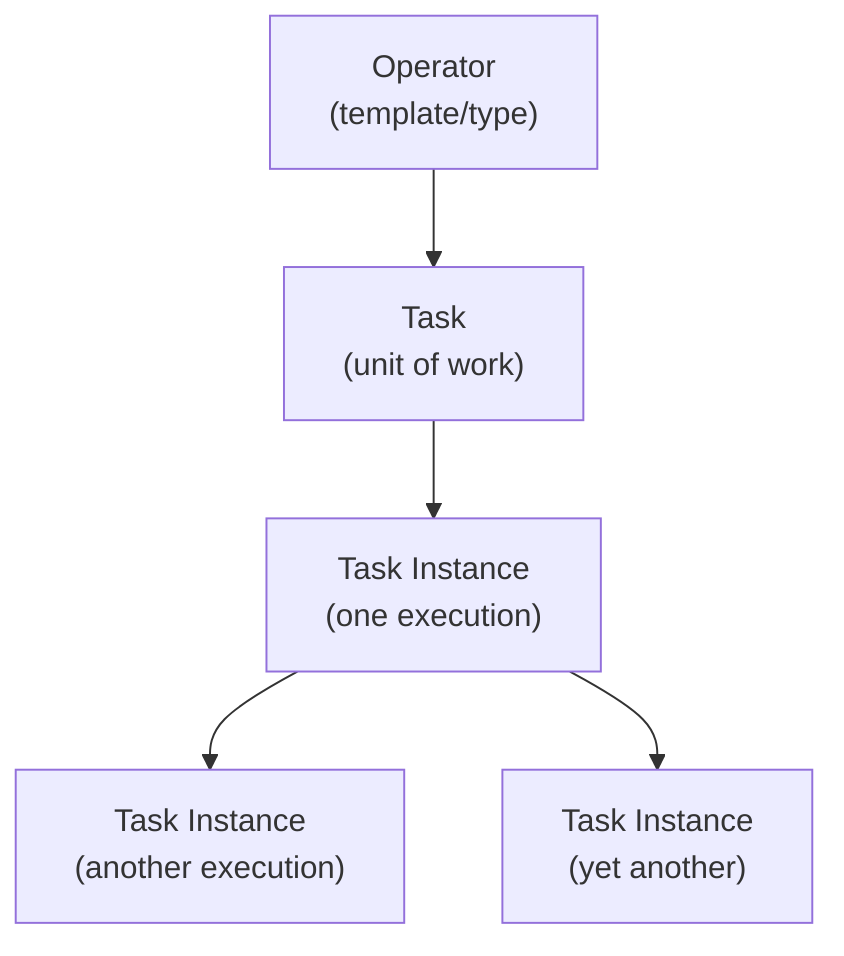

> **Operator** = the category (Python, Bash, SQL).
> **Task** = the actual work.
> **Task Instance** = one run of that task at a specific time.

---

# Part II -- Setup

---

## 7. Installation & Setup

Airflow runs via **Docker** for local development. A native install without Docker is very difficult.

### Prerequisites

| Requirement | How to check/install |
|------------|---------------------|
| **Virtualization enabled** | Task Manager → Performance tab → Virtualization: Enabled |
| **WSL2** (Windows) | Enable in Windows Features (see below) |
| **Docker Desktop** | Download from docker.com |

### Step-by-Step (Windows)

**1. Enable WSL2**
- Search "Turn Windows features on or off"
- Enable: **Windows Subsystem for Linux** and **Virtual Machine Platform**
- Restart your computer

**2. Install Docker Desktop**
- Download from https://docker.com for your OS
- Restart after installation
- In Docker Desktop → Settings → Resources → confirm WSL2 backend

**3. Install WSL Ubuntu (if needed)**
```bash
wsl --install -d Ubuntu
wsl -l -v   # verify
```

**4. Set up Airflow project**
```bash
mkdir airflow-project && cd airflow-project
```

**5. Get the official docker-compose file**
- Search "airflow docker compose" → use the file from the official Airflow docs
- Place `docker-compose.yaml` in your project folder

**6. Create `.env` file**
```
AIRFLOW_UID=50000
```
On Linux/Mac, get the value with: `echo -e "AIRFLOW_UID=$(id -u)"`

**7. Initialize and start Airflow**
```bash
docker compose up airflow-init    # First time: initialize the DB
docker compose up -d              # Start all services
```

**8. Access the UI**
- URL: `http://localhost:8080`
- Username: `airflow`
- Password: `airflow`

Wait until all services show green in Docker Desktop before accessing the UI.

### Production Options

For production, consider managed services: **Astronomer**, **AWS MWAA**, **Azure Fabric managed Airflow**.

---

## 8. The Airflow UI

Access at `http://localhost:8080` (HTTP, not HTTPS for localhost).

### Main Sections

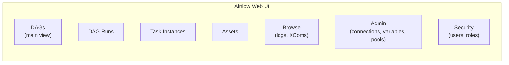

| Section | What it shows |
|---------|--------------|
| **DAGs** | All your DAGs -- toggle on/off, trigger runs, view status |
| **DAG Runs** | History of all DAG executions (success, failed, running) |
| **Task Instances** | Individual task execution records |
| **Assets** | Data assets for cross-DAG dependencies (Airflow 3.x) |
| **Browse** | Audit logs, XCom values, required actions |
| **Admin** | **Connections** (DB/API creds), **Variables** (key-value config), **Pools** (concurrency limits) |
| **Security** | User management, roles, permissions |

### Connections (Important)

Store credentials for external systems under **Admin → Connections**:
- PostgreSQL, Redshift, Snowflake, S3, Azure Blob, APIs, etc.
- Each connection has: Connection ID, type, host, login, password, schema, port

### UI Tips

- Hide example DAGs: set `load_examples=False` in config
- Switch between **Grid** view and **Graph** view to visualize DAGs
- Dark mode and timezone settings available under user settings
- Built with React in Airflow 3.x

---

# Part III -- Hands-On Chapters

---

## Ch 1: Linear DAG & Parsing

Your first DAG. Uses the **TaskFlow API** (decorator-based, recommended for Airflow 3.x).

### Code

```python
from airflow.decorators import dag, task

@dag(dag_id="first_dag")
def my_first_dag():

    @task.python
    def extract():
        print("Extracting data")

    @task.python
    def transform():
        print("Transforming data")

    @task.python
    def load():
        print("Loading data")

    extract() >> transform() >> load()

my_first_dag()
```

### Resulting Graph

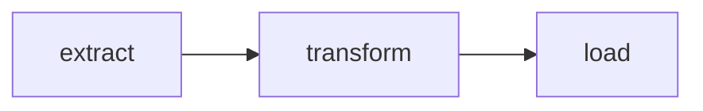

### Key Points

| Concept | Detail |
|---------|--------|
| `@dag` | Decorator that defines a DAG. If `dag_id` is omitted, the function name is used. |
| `@task.python` | Decorator that defines a Python task. `@task` alone also works. |
| `>>` | Dependency operator: "must complete before" |
| **Parsing** | Airflow scans the `dags/` folder every ~10 seconds. New DAGs take a moment to appear. |

### Gotcha

Don't panic if your DAG doesn't show up instantly. Wait ~10 seconds for the parser to pick it up.

---

## Ch 2: DAG Versioning

When you modify a DAG's structure, Airflow automatically creates a **new version** (v1, v2, etc.) visible in the UI.

```python
@dag(dag_id="version_dag")
def version_dag():
    @task.python
    def task_a():
        print("Original task")

    @task.python
    def task_b():
        print("Added in version 2")

    task_a() >> task_b()

version_dag()
```

- Each structural change creates a new version
- You can view version history in the UI
- DAG ID stays the same; only the version number increments

---

## Ch 3: Operators & DAG Syncing

Besides the TaskFlow API (`@task`), you can use **operators** -- the classic approach.

### BashOperator Example

```python
from airflow.decorators import dag, task
from airflow.operators.bash import BashOperator

@dag(dag_id="operator_dag")
def operator_dag():

    @task.python
    def python_task():
        print("Python task")

    bash_task = BashOperator(
        task_id="bash_task",
        bash_command="echo 'Hello from Bash'",
    )

    python_task() >> bash_task

operator_dag()
```

### Mixing Styles

You can mix TaskFlow tasks (`@task.python`) with classic operators (`BashOperator`) in the same DAG. Use `>>` for dependencies either way.

### DAG Syncing

- The `dags/` folder syncs in **real-time** with Docker volumes
- **Parsing** happens on a schedule (~10 seconds)
- File appears instantly in the folder → takes a few seconds to appear in the UI

---

## Ch 4: XCOMs (Automatic)

**XCOMs** (Cross-Communications) let you pass data from one task to another.

### Automatic XCOMs

When a task **returns** a value, Airflow automatically pushes it to XCom with the key `return_value`. The next task can receive it as a function argument.

```python
@dag(dag_id="xcom_auto_dag")
def xcom_auto_dag():

    @task.python
    def extract():
        return [1, 2, 3, 4, 5]  # auto-pushed to XCom

    @task.python
    def transform(data):         # auto-pulled from XCom
        return [x * 2 for x in data]

    @task.python
    def load(data):
        print(f"Loading: {data}")

    raw = extract()
    transformed = transform(raw)
    load(transformed)

xcom_auto_dag()
```

### Data Flow

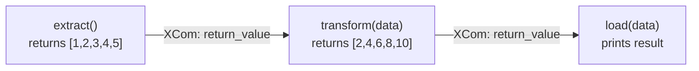

### Rules

- Default XCom key is `return_value`
- Data must be **serializable** (lists, dicts, strings, numbers)
- XCom values are visible in the UI under Browse → XCom
- **No explicit `>>` needed**: When you pass a task's return value as an argument to another task (e.g., `transform(extract())`), Airflow automatically infers the dependency order -- no need to write `extract >> transform >> load`

---

## Ch 5: XCOMs (Manual) with kwargs

For more control, use **manual XCOMs** via the task instance (`ti`).

### Code

```python
@dag(dag_id="xcom_manual_dag")
def xcom_manual_dag():

    @task.python
    def extract(**kwargs):
        ti = kwargs["ti"]
        data = {"users": [1, 2, 3], "orders": [10, 20, 30]}
        ti.xcom_push(key="extracted_data", value=data)

    @task.python
    def transform(**kwargs):
        ti = kwargs["ti"]
        data = ti.xcom_pull(task_ids="extract", key="extracted_data")
        result = {k: [x * 2 for x in v] for k, v in data.items()}
        ti.xcom_push(key="transformed_data", value=result)

    @task.python
    def load(**kwargs):
        ti = kwargs["ti"]
        data = ti.xcom_pull(task_ids="transform", key="transformed_data")
        print(f"Loading: {data}")

    e = extract()
    t = transform()
    l = load()
    e >> t >> l

xcom_manual_dag()
```

### Manual vs Automatic XCOMs

| Feature | Automatic | Manual |
|---------|----------|--------|
| Push | `return value` | `ti.xcom_push(key, value)` |
| Pull | Function argument | `ti.xcom_pull(task_ids, key)` |
| Custom keys | No (always `return_value`) | Yes |
| When to use | Simple linear flows | Complex graphs, multiple outputs |

### Accessing the Task Instance

```python
def my_task(**kwargs):
    ti = kwargs["ti"]          # task instance
    # ti.xcom_push(...)
    # ti.xcom_pull(...)
```

The `**kwargs` context dictionary also contains `dag_run`, `params`, `data_interval_start`, and more.

---

## Ch 6: Parallel Tasks

Run multiple tasks simultaneously, then converge.

### The Fan-Out / Fan-In Pattern

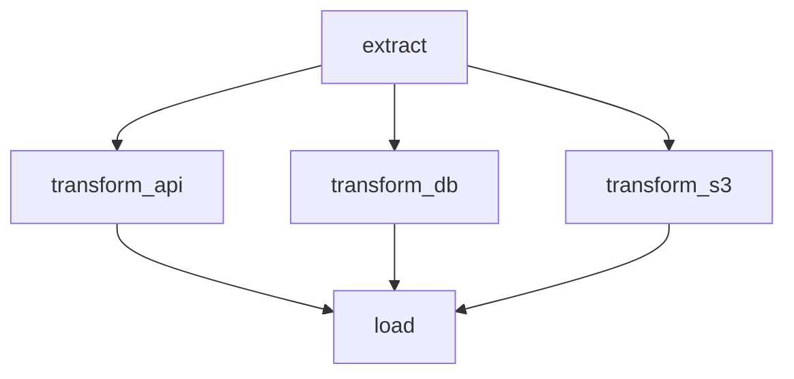

### Code

```python
@dag(dag_id="parallel_dag")
def parallel_dag():

    @task.python
    def extract(**kwargs):
        ti = kwargs["ti"]
        ti.xcom_push(key="data", value={
            "api": [1, 2, 3],
            "db": [4, 5, 6],
            "s3": [7, 8, 9],
        })

    @task.python
    def transform_api(**kwargs):
        ti = kwargs["ti"]
        data = ti.xcom_pull(task_ids="extract", key="data")
        ti.xcom_push(key="result", value=[x * 10 for x in data["api"]])

    @task.python
    def transform_db(**kwargs):
        ti = kwargs["ti"]
        data = ti.xcom_pull(task_ids="extract", key="data")
        ti.xcom_push(key="result", value=[x * 10 for x in data["db"]])

    @task.python
    def transform_s3(**kwargs):
        ti = kwargs["ti"]
        data = ti.xcom_pull(task_ids="extract", key="data")
        ti.xcom_push(key="result", value=[x * 10 for x in data["s3"]])

    @task.python
    def load(**kwargs):
        ti = kwargs["ti"]
        api = ti.xcom_pull(task_ids="transform_api", key="result")
        db = ti.xcom_pull(task_ids="transform_db", key="result")
        s3 = ti.xcom_pull(task_ids="transform_s3", key="result")
        print(f"Loaded: API={api}, DB={db}, S3={s3}")

    e = extract()
    t1 = transform_api()
    t2 = transform_db()
    t3 = transform_s3()
    l = load()

    e >> [t1, t2, t3] >> l

parallel_dag()
```

### Key Syntax

```python
# Fan-out then fan-in:
extract >> [transform_a, transform_b, transform_c] >> load
```

- Use a **list** `[...]` for parallel tasks
- Downstream task (`load`) runs only when **ALL** parallel tasks succeed

---

## Ch 7: Conditional Branches

A **branch task** evaluates a condition and decides which path to take.

### How Branching Works

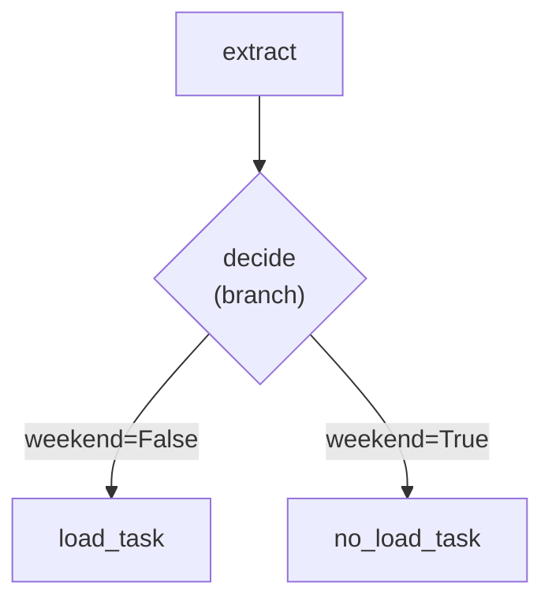

### Code

```python
@dag(dag_id="branch_dag")
def branch_dag():

    @task.python
    def extract(**kwargs):
        ti = kwargs["ti"]
        ti.xcom_push(key="data", value={
            "records": [1, 2, 3],
            "weekend_flag": False,
        })

    @task.branch
    def decide(**kwargs):
        ti = kwargs["ti"]
        data = ti.xcom_pull(task_ids="extract", key="data")
        if data["weekend_flag"]:
            return "no_load_task"    # must match task_id EXACTLY
        return "load_task"

    @task.python(task_id="load_task")
    def load():
        print("Loading data...")

    @task.python(task_id="no_load_task")
    def no_load():
        print("Weekend -- skipping load")

    e = extract()
    d = decide()
    l = load()
    n = no_load()

    e >> d >> [l, n]

branch_dag()
```

### Rules

| Rule | Detail |
|------|--------|
| Decorator | `@task.branch` for the decider function |
| Return value | Must be the **exact `task_id` string** of the task to run |
| Skipped tasks | Appear as "skipped" (pink) in the UI |
| Graph view | Branch dependencies shown as **dotted lines** |
| List syntax | `d >> [l, n]` means "decide WHICH to run", not "run both" |

---

## Ch 8: Scheduling Presets

The simplest way to schedule a DAG. Four variables control scheduling:

| Variable | Required? | Purpose |
|----------|:---------:|---------|
| `start_date` | Yes | When the DAG becomes eligible to run |
| `end_date` | No | When to stop (default: never) |
| `catchup` | No | Run missed intervals? (default: True) |
| `schedule` | Yes | Timing/interval definition |

### Available Presets

| Preset | Runs at |
|--------|---------|
| `"daily"` | Midnight every day |
| `"hourly"` | Start of every hour |
| `"weekly"` | Midnight on the first day of the week |
| `"monthly"` | Midnight on the 1st of each month |

### Code

```python
from airflow.decorators import dag, task
from pendulum import datetime

@dag(
    dag_id="preset_dag",
    start_date=datetime(2026, 1, 26),
    schedule="daily",
    catchup=False,
)
def preset_dag():

    @task.python
    def run_pipeline():
        print("Running daily pipeline")

    run_pipeline()

preset_dag()
```

### Catchup Behavior

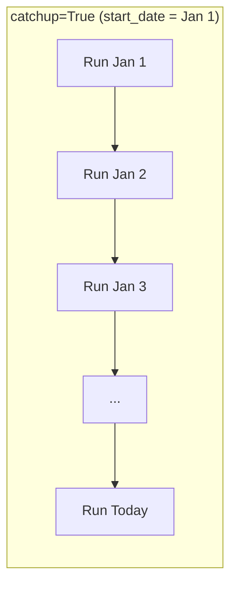

If `start_date` is far in the past and `catchup=True`, Airflow will create runs for **every missed interval**. Use `catchup=False` for new DAGs unless you need backfill.

> Always use **Pendulum** for dates in Airflow -- it handles time zones correctly.

---

## Ch 9: Cron Syntax

The most **flexible** time-based scheduling. Cron uses 5 fields:

```
┌───────────── minute (0-59)
│ ┌───────────── hour (0-23)
│ │ ┌───────────── day of month (1-31)
│ │ │ ┌───────────── month (1-12)
│ │ │ │ ┌───────────── day of week (0-6, Mon-Sun)
│ │ │ │ │
* * * * *
```

### Common Examples

| Expression | Meaning |
|-----------|---------|
| `0 0 * * *` | Daily at midnight |
| `0 * * * *` | Every hour |
| `0 16 * * 1-5` | 4:00 PM Monday-Friday |
| `*/15 * * * *` | Every 15 minutes |
| `0 9 1 * *` | 9:00 AM on the 1st of every month |

> Use [crontab.guru](https://crontab.guru) to build and verify cron expressions.

### Code

```python
from airflow.decorators import dag, task
from airflow.timetables.trigger import CronTriggerTimetable
from pendulum import datetime

@dag(
    dag_id="cron_dag",
    start_date=datetime(2026, 1, 26),
    schedule=CronTriggerTimetable("0 16 * * 1-5"),  # 4 PM weekdays
    catchup=False,
)
def cron_dag():

    @task.python
    def weekday_report():
        print("Generating weekday report at 4 PM")

    weekday_report()

cron_dag()
```

Use `CronTriggerTimetable` from `airflow.timetables.trigger`.

---

## Ch 10: Delta Trigger

For **interval-based** scheduling (e.g., "every 3 days") where cron doesn't work cleanly across month boundaries.

### Why not cron for "every 3 days"?

Cron would need: `0 0 1,4,7,10,13,16,19,22,25,28,31 * *` -- and February has no 31st. Breaks.

### Code

```python
from airflow.decorators import dag, task
from airflow.timetables.delta import DeltaTriggerTimetable
import pendulum

@dag(
    dag_id="delta_dag",
    start_date=pendulum.datetime(2026, 1, 1),
    schedule=DeltaTriggerTimetable(duration=pendulum.duration(days=3)),
    catchup=False,
)
def delta_dag():

    @task.python
    def periodic_task():
        print("Running every 3 days")

    periodic_task()

delta_dag()
```

### Execution Pattern

```
Jan 1 → Jan 4 → Jan 7 → Jan 10 → ... → Jan 31 → Feb 3 → ...
```

No month-boundary issues.

### Scheduling Method Comparison

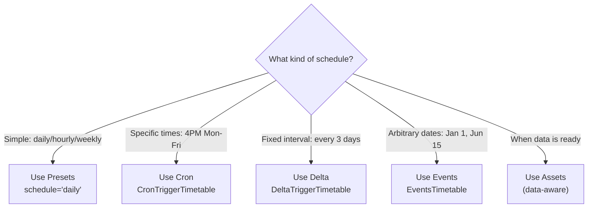

---

## Ch 11: Incremental Load & Jinja Templates

### Incremental Load

Instead of reloading ALL data every run, load only **new or changed data** since the last run. This is a core data engineering pattern.

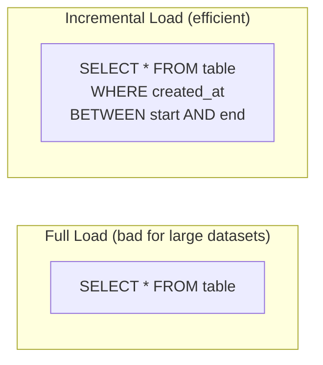

### Context Variables

Airflow automatically provides date boundaries for each run:

| Variable | Description |
|----------|------------|
| `data_interval_start` | Start of the current data interval |
| `data_interval_end` | End of the current data interval |
| `logical_date` | The logical execution date |
| `ds` | Execution date as `YYYY-MM-DD` string |

### Jinja Templating (BashOperator)

Use `{{ variable }}` syntax in templated fields:

```python
from airflow.operators.bash import BashOperator

incremental = BashOperator(
    task_id="incremental_load",
    bash_command=(
        "echo 'Loading data from {{ data_interval_start }} "
        "to {{ data_interval_end }}'"
    ),
)
```

### Python Access (via kwargs)

```python
@task.python
def incremental_load(**kwargs):
    start = kwargs["data_interval_start"]
    end = kwargs["data_interval_end"]

    query = f"""
        SELECT * FROM orders
        WHERE created_at BETWEEN '{start}' AND '{end}'
    """
    print(f"Running: {query}")
```

### Where Do `data_interval_start` & `data_interval_end` Come From?

These are **Airflow context variables** automatically injected at runtime by the timetable/schedule. When a task function accepts `**kwargs`, Airflow populates that dictionary with a full execution context -- no manual setup required.

The timetable (e.g., `CronDataIntervalTimetable("@daily")`) determines the logical time window each DAG run is responsible for. For a daily schedule, a run triggered on January 28th would have:

| Variable | Value |
|----------|-------|
| `data_interval_start` | `2026-01-27 00:00:00+01:00` |
| `data_interval_end` | `2026-01-28 00:00:00+01:00` |

The task **runs** at `data_interval_end` but processes data **for** the interval between start and end.

**Two ways to access them:**

| Method | Where | Syntax |
|--------|-------|--------|
| Python `kwargs` | `@task.python` functions | `kwargs['data_interval_start']` |
| Jinja templating | Templated fields (e.g., BashOperator) | `{{ data_interval_start }}` |

Both pull from the same Airflow context. Other commonly used context variables in `kwargs` include `ds` (logical date as `YYYY-MM-DD`), `ts` (ISO timestamp), `dag_run`, `ti` (task instance), and `params`.

### Interval Visualization

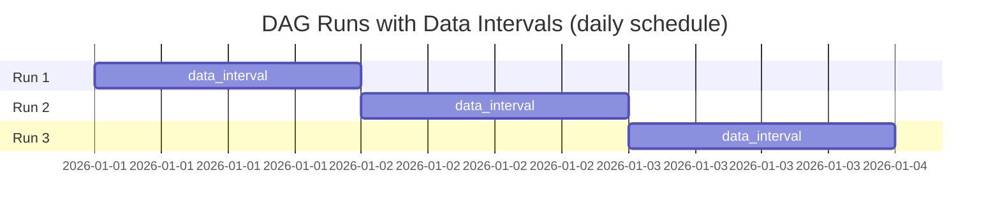

Each run processes **only its interval** -- no overlap, no gaps.

---

## Ch 12: Special Schedules with Events

For **arbitrary, non-recurring dates** (holidays, ceremonies, ad-hoc runs).

### Code

```python
from airflow.decorators import dag, task
from airflow.timetables.events import EventsTimetable
import pendulum

special_dates = [
    pendulum.datetime(2026, 1, 1),    # New Year
    pendulum.datetime(2026, 1, 15),   # Custom event
    pendulum.datetime(2026, 6, 1),    # Mid-year review
    pendulum.datetime(2026, 12, 31),  # Year-end
]

@dag(
    dag_id="events_dag",
    start_date=pendulum.datetime(2026, 1, 1),
    schedule=EventsTimetable(special_dates),
    catchup=False,
)
def events_dag():

    @task.python
    def run_on_special_date():
        print("Running on a special date")

    run_on_special_date()

events_dag()
```

Import `EventsTimetable` from `airflow.timetables.events`. The UI will show "events" instead of a cron expression.

---

## Ch 13: Assets

**Assets** (Airflow 3.x, replacing "Datasets" from 2.x) enable **data-aware scheduling**: a DAG runs when its input data is ready, not on a time schedule.

### Concept

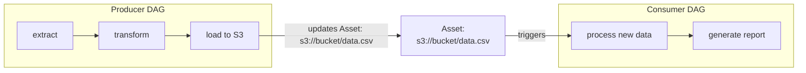

### Key Points

| Concept | Detail |
|---------|--------|
| **Asset** | A logical representation of data (table, file, URI) |
| **Producer** | A task that updates an asset |
| **Consumer** | A DAG that triggers when an asset is updated |
| **Data-aware scheduling** | Runs based on data availability, not time |

- Assets create **cross-DAG dependencies** based on data
- New in Airflow 3.x; see official docs for the full API
- More powerful than Datasets (2.x) with additional metadata support

---

## Ch 14: Inherited DAG Orchestration

Orchestrate **multiple DAGs** in sequence: a parent DAG triggers child DAGs in order.

### Architecture

```mermaid
flowchart TD
    subgraph "Parent DAG (orchestrator)"
        T1["Trigger: sales_dag"]
        T2["Trigger: reporting_dag"]
        T1 --> T2
    end

    T1 -.->|"triggers"| D1
    T2 -.->|"triggers"| D2

    subgraph "sales_dag (child)"
        D1A["extract"] --> D1B["transform"] --> D1C["load"]
    end
    D1["sales_dag"]

    subgraph "reporting_dag (child)"
        D2A["aggregate"] --> D2B["generate report"]
    end
    D2["reporting_dag"]
```

### Code

```python
from airflow.decorators import dag
from airflow.operators.trigger_dagrun import TriggerDagRunOperator
from pendulum import datetime

@dag(
    dag_id="parent_orchestrator",
    start_date=datetime(2026, 1, 1),
    schedule="daily",
    catchup=False,
)
def parent_orchestrator():

    trigger_sales = TriggerDagRunOperator(
        task_id="trigger_sales_dag",
        trigger_dag_id="sales_dag",
    )

    trigger_reporting = TriggerDagRunOperator(
        task_id="trigger_reporting_dag",
        trigger_dag_id="reporting_dag",
    )

    trigger_sales >> trigger_reporting

parent_orchestrator()
```

### Key Points

- `TriggerDagRunOperator` from `airflow.operators.trigger_dagrun`
- Child DAGs remain independent and can also run on their own schedule
- The parent only controls execution **order**
- All DAGs must be in the same `dags/` folder

---

# Quick Reference

## All Scheduling Methods

| Method | Import | Example |
|--------|--------|---------|
| **Preset** | (none) | `schedule="daily"` |
| **Cron** | `from airflow.timetables.trigger import CronTriggerTimetable` | `schedule=CronTriggerTimetable("0 16 * * 1-5")` |
| **Delta** | `from airflow.timetables.delta import DeltaTriggerTimetable` | `schedule=DeltaTriggerTimetable(duration=pendulum.duration(days=3))` |
| **Events** | `from airflow.timetables.events import EventsTimetable` | `schedule=EventsTimetable([date1, date2])` |
| **Assets** | (see docs) | Data-aware: triggers when upstream asset is updated |

## All Chapter Patterns

| Chapter | Pattern | Key Syntax |
|---------|---------|-----------|
| 1 | Linear DAG | `a >> b >> c` |
| 2 | Versioning | Modify DAG → new version in UI |
| 3 | Operators | `BashOperator(task_id=..., bash_command=...)` |
| 4 | Auto XCom | `return value` → next task gets it as argument |
| 5 | Manual XCom | `ti.xcom_push(key, value)` / `ti.xcom_pull(task_ids, key)` |
| 6 | Parallel | `extract >> [t1, t2, t3] >> load` |
| 7 | Branch | `@task.branch` → return `"task_id"` |
| 8 | Preset schedule | `schedule="daily"` |
| 9 | Cron schedule | `CronTriggerTimetable("0 16 * * 1-5")` |
| 10 | Delta schedule | `DeltaTriggerTimetable(duration=pendulum.duration(days=3))` |
| 11 | Incremental | `{{ data_interval_start }}` / `kwargs["data_interval_start"]` |
| 12 | Events | `EventsTimetable([date1, date2, ...])` |
| 13 | Assets | Data-aware cross-DAG triggers |
| 14 | Orchestration | `TriggerDagRunOperator(trigger_dag_id="child_dag")` |

## Core Glossary

| Term | Definition |
|------|-----------|
| **Airflow** | Open-source orchestration framework |
| **DAG** | Directed Acyclic Graph -- a workflow with direction and no cycles |
| **Task** | Single unit of work |
| **Task Instance** | One execution of a task for a specific DAG run |
| **Operator** | Predefined template defining the type of task |
| **XCom** | Cross-communication -- pass data between tasks |
| **Metadata DB** | PostgreSQL database storing all Airflow state |
| **DAG Processor** | Parses DAG files from the `dags/` folder |
| **Scheduler** | Decides what and when to run |
| **Executor** | Decides how and where to run (strategy only) |
| **Worker** | Actually executes the task code |
| **Triggerer** | Monitors deferred tasks for async operations |
| **Asset** | Logical data representation for data-aware scheduling |
| **Connection** | Stored credentials for external systems |
| **Pendulum** | Python datetime library used by Airflow |

---

*Course content extracted and structured from: "Airflow Tutorial For Beginners (2026) | Apache Airflow Full Course"*
